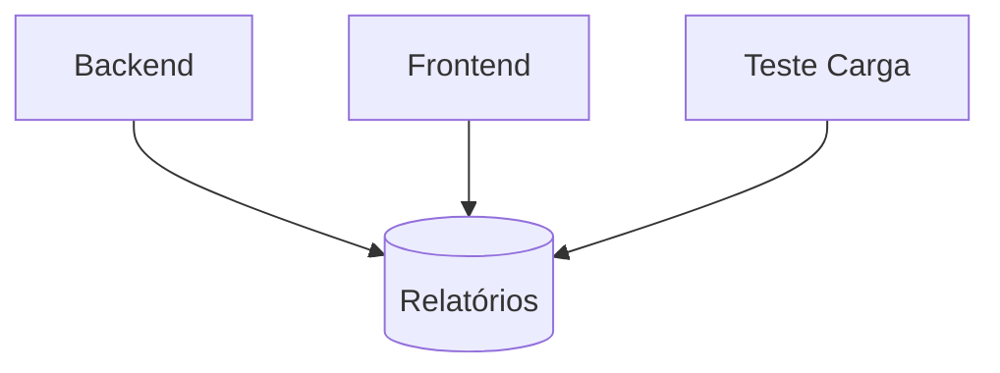

## 📌 Projeto de Automação Completa

  

### 🚀 Visão Geral do Projeto

Este projeto combina testes E2E (Cypress), testes de carga (k6) e testes mobile (Robot Framework + Appium) para oferecer uma solução completa de qualidade automatizada. O objetivo é garantir a qualidade em quatro frentes:

  

1. Backend ServeRest (Cypress)

2. Frontend ServeRest (Cypress)

3. Testes de Carga (k6)

4. Aplicativo Mobile (Robot Framework + Appium)

  

### 📌 Expectativas e Objetivos

#### ✅ O que este projeto entrega:

  

- Cobertura multiplataforma

- Testes web e mobile integrados

- Validação de APIs e interfaces

- Dados de teste sincronizados

  

## 🔍 Estrutura do projeto

```bash

outsera-QA/

├──  ServeRest-Cypress/

│  ├──  cypress/  # Testes Web e API

│  ├──  k6/  # Testes de carga

├──  qafood-robot-appium/  # Testes Mobile

└──  .github/workflows/  # CI/CD integrado

```

  

## 📊 Relatórios Consolidados

| Plataforma | Ferramenta | Localização Relatórios |
|:----------:|:-------------:|:----------------------------:|
| Web/API | Cypress | cypress/results/ |
| Carga | k6 | /results/ |
| Mobile | Appium | /results/ |


## 🚀 CI/CD Integrado
  

Pipeline automatizado no GitHub Actions para testes, relatórios e integração contínua.

```plaintext

*Observação ao fluxo mobile*:
Appium e o RobotFramework devem estar rodando localemente para executar os testes mobile.
A execução CI do mobile é muito instável para gerar um emulador e executar o appium.
Portanto, é recomendado rodar localmente, Firebase Test Lab ou AWS Device Farm.

```

### Fluxo de Execução



### Como Visualizar Resultados

1. Acesse a aba Actions no GitHub
2. Selecione a execução desejada
3. Baixe o artefato gerados: "resumo-testes"


## Análise dos Resultados e Conclusão

**Testes de Carga (load_result.json)**
Os testes foram feitos em ambiente local com 500 VUs por 5min. Para o GitHub Actions esse valor foi reduzido para evitar quebra e teste instável na pipeline (5 VUs ~ 30sec).
```plaintext
1. Problemas Identificados:
- Login e Token: 51.3% das requisições falharam (`http_req_failed: 0.512`).
2. Checks Críticos:            
	Login bem-sucedido`: 924 falhas vs. 878 passos.
    Token retornado`: 924 falhas vs. 878 passos.
3. Tempo de Resposta:
        Pico de 235ms  (aceitável, mas com falhas que sugerem instabilidade).
        Threshold Excedido:  `p(95)<500`  não atendido em  `http_req_duration`.
            
Possíveis Causas:
- Limitações de autenticação (ex: taxa de geração de tokens).
- Configuração inadequada de timeout ou concorrência.
```

**Testes de Frontend (frontend-report.json)**

```plaintext
1. Todos os 5 testes passaram (`"passes": 5`), cobrindo:
-   Criação de usuários admin/não admin.            
-   Login e navegação.            
-   Criação de produtos.
            
2.  Performance:
-  "Criar Usuário Admin" demora 2715 ms – pode indicar lentidão na renderização ou chamadas API.
                
Recomendações:
-Reduzir tempos de espera em testes (ex: usar  `cy.intercept()`  para mock de APIs).
- Incluir testes de responsividade e acessibilidade.
```

**Testes de Backend (backend-report.json)**

```plaintext
1. Todos os 11 testes passaram (`"passes": 11`), cobrindo:
- CRUD de produtos e usuários.
- Validação de campos obrigatórios (nome, email, senha).
- Gestão de tokens (ex: edição sem token retorna 401).
            
2. Duração dos Testes:
- Testes como "Editar produto com sucesso" demoram 562 ms (mais que o dobro de outros).
        
Recomendações:
- Otimização:   Investigar por que a edição de produtos é lenta (ex: consultas complexas).
- Cobertura:  Adicionar testes para limites de caracteres e valores inválidos (ex: email mal formatado)
```
